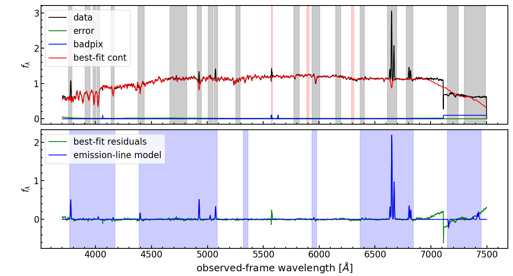

# PyParadise
## Scope 
PyParadise is a general purpose analysis tool for galaxy spectra. It performs stellar 
population synthesis modelling of the stellar continuum and subsequent emission lines fitting.
In contrast to other fitting codes it normalizes the continuum shape before fitting instead of
adding arbitraty polynomial function to account for systematic uncertainties in the spectral slope.
Furthermore, non-linear optimization is separate from linear optimization with an iterative scheme
for speed gain an allowing for a determination of uncertainties on all parameters through MCMC and
bootstrapping. It is easily scalable to big data through multiprocessing with many cores.

## Installation instructions
PyParadise is running only on Python 3 systems and support for Python 2 is removed. To avoid
potential conflict of package dependencies we strongly recommand to use an environment management
system like conda (or similar)

1. download PyParadise from github.com/brandherd/PyParadise
2. run `pip install .` or `python setup.py install` to install PyParadise
3. change into the example directory and call `source run_all.sh`
4. the process should take some time and should produce a NGC2691.spec_fit.png as shown below
   
If the image looks like the one below your PyParadise installation works.

## Basic usage and commands
For the ease of simplicity and usage, PyParadise is primarly executed from the command line. There
are a view primary commands to execute PyParadise:

1. ParadiseApp.py INPUT_DATA OUTPUT_PREFIX SPEC_FWHM_DATA --SSP_par FILE_PAR_STELLAR
2. ParadiseApp.py INPUT_DATA OUTPUT_PREFIX SPEC_FWHM_DATA --line_par FILE_PAR_ELINES
3. (optional) ParadiseApp.py INPUT_DATA OUTPUT_PREFIX SPEC_FWHM_DATA --SSP_par FILE_PAR_STELLAR
   --line_par FILE_PAR_ELINES --bootstraps N_ITERATIONS --modkeep PERCENT_OF_SSPs 

Step 1. and 2. can be combined into one single command by setting both options simultanously.
Please have a look at the parameter files of the example data and test case. Those 
parameter files appear complex but usually only a few parameters need to be changed. Guidelines
are provided in the manual.  

## Manual for more information on parameter file setup
More details on the underlying algorithms and principles of PyParadise can be found in
the PyParadise user manual in the doc directory. This provides some important consideration
and tips to setup the parameter files and the necessary data format structure for the input
data accepted by PyParadise in command line mode. 
